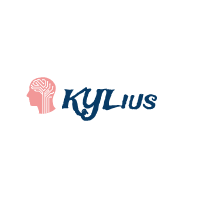

# KYLius-method
새로운 마음으로.

  

### 현재의 역할 분담
##### (4월 18일 수요일/ 19일 목요일/ 20일 금요일 3일간. 금요일 회의 때 다시 조정)
(금요일에 할 발표 준비)

대곤: 알고리즘 설명(cnn, max_pool, dropout, leaky_relu, AdamOptimizer) / 피피티 정리 

수원: 이미지 디스플레이

상욱: 손글씨 테스트

승혁: 손글씨 테스트

### 폴더 설명
##### 우리 KYLius 의 깃허브 repository 는 세 가지 공간으로 나눠서 관리하고 있습니다(아래).
1. 각자의 개인 폴더  
<pre> 각자 개인적인 작업, 또는 팀프로젝트 관련 작업이지만 아직 공유하기엔 정리가 덜 된 것들을 모아놓는 공간입니다. 개인적인 공간이긴 하지만 누가 보더라도 대략 뭘 하고 있는지 알아볼 수 있게끔 적절한 주석은 필수! </pre>
2. PAPERS - 논문 및 공부할 자료  
<pre> 우리가 함께 공부하면 좋을 논문이나 자료들을 올리는 공간입니다. </pre>
3. PROJECT - 치열한 공개의 장  
<pre> 엄선된 자료, 혹은 모듈식 개발에 끼워넣을 수 있는 완성된 코드만 올리는 공간입니다. </pre>

### 우리가 주로 참고했거나, 참고하고 있는 자료들
1. 김성훈교수 강의  
https://www.youtube.com/watch?v=BS6O0zOGX4E&list=PLlMkM4tgfjnLSOjrEJN31gZATbcj_MpUm

2. 캐글 MNIST 데이터셋  
https://www.kaggle.com/c/digit-recognizer

