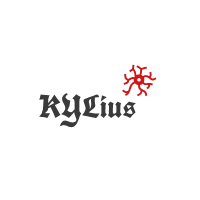

# KYLius-method

<i>2번째 도전</i>

  

## Second Challenge

기간: 4월 23일 (월요일) ~ 5월 3일 (목요일) 약 2주간

 

## 폴더 설명
##### 우리 KYLius 의 깃허브 repository 는 세 가지 공간으로 나눠서 관리하고 있습니다(아래).
1. 각자의 개인 폴더  
<pre> 각자 개인적인 작업, 또는 팀프로젝트 관련 작업이지만 아직 공유하기엔 정리가 덜 된 것들을 모아놓는 공간입니다.   개인적인 공간이긴 하지만 누가 보더라도 대략 뭘 하고 있는지 알아볼 수 있게끔 적절한 주석은 필수! </pre>
2. PAPERS - 논문 및 공부할 자료  
<pre> 우리가 함께 공부하면 좋을 논문이나 자료들을 올리는 공간입니다. </pre>
3. PROJECT - 치열한 공개의 장  
<pre> 엄선된 자료, 혹은 모듈식 개발에 끼워넣을 수 있는 완성된 코드만 올리는 공간입니다. </pre>
 

## 지난 주제: 
1. MNIST DIGITS RECOGNIZER
<pre>
2018. 4/6~4/20
캐글 MNIST 데이터셋을 가지고 99.5% 정확도로 숫자 이미지를 분류하는 모델, 프로그램을 만듬(Tensorflow, CNN 활용).  
데이터셋: https://www.kaggle.com/c/digit-recognizer
</pre>
